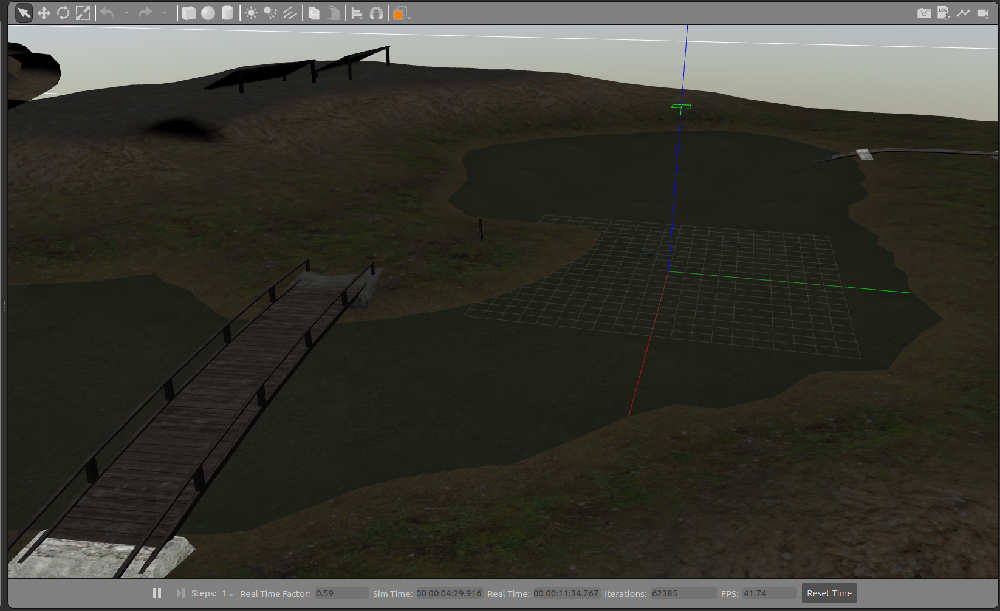

<p align="center">
  
</p>

# KON-414E Final Project
This repository contains ROS Packages about Final Project of the **KON414E** *"Principles of Robot Autonomy"* Course 
given at **Istanbul Technical University** in the fall term of 2024/2025.
<br>

## Objective: 3D Mapping of the Environment
### Robot
<p align="center">
  
</p>
<p align="center">
  <a href="https://global.agilex.ai/products/hunter-2-0"><strong>AgileX HUNTER 2.0</strong></a>
</p>

### Sensors
<ol>
    <li>3D LIDAR</li>
        <ul>
            <li>360° horizontal and 30° vertical FOV</li>
            <li>0.5° horizontal and vertical resolution</li>
            <li>20m range</li>
            <li>10Hz refresh rate</li>
        </ul>
    <li>RTK-GPS</li>
        <ul>
            <li>+/-2cm precision</li>
        </ul>
</ol>

### Project Description
<ol>
  <li>Point Cloud Map generation for the <strong>Gazebo</strong> environment 
(<a href="https://github.com/clearpathrobotics/cpr_gazebo"><strong>Clearpath Robotics Inspection World</strong></a>)
 using <strong>RTAB Mapping</strong></li>
  <li> Odometry source will be <strong>RTK-GPS</strong> + <strong>Wheel Odometry</strong> of the vehicle 
(fusing with <em>robot_localization</em> package)</li>
  <li>Converting Point Cloud Map into <strong>Octomap(s)</strong> with different resolutions and evaluate resolution effects on 
environment representation</li>
  <li>Check map resolution effect on <strong>Autonomous Navigation</strong></li>
</ol>
<br/>

## Gazebo World: CPR Inspection World
|   |   |
|---|---|
  |  
  |  

## Some Stages of the Project
|   |   |
|---|---|
  |  
<p align="center">
  
</p>

<br/>

## Installation
<ol>
    <li>Clone the repository to your workspace's src directory.</li>
    <li>Go to parent directory.</li>
    <li>Build workspace.</li>
</ol>

```
cd your_workspace/src
git clone "repository link"
cd ..
catkin_make
```

### Dependency
<ul>
    <li><a href="https://github.com/clearpathrobotics/cpr_gazebo">
<em>hector_gazebo_plugins</em></a> for Gazebo GPS plugin</li>
    <li><a href="https://github.com/pal-robotics-forks/point_cloud_converter">
<em>point_cloud_converter</em></a> to convert PointCloud to PointCloud2</li>
    <li>Robot packages...</li>
</ul>
